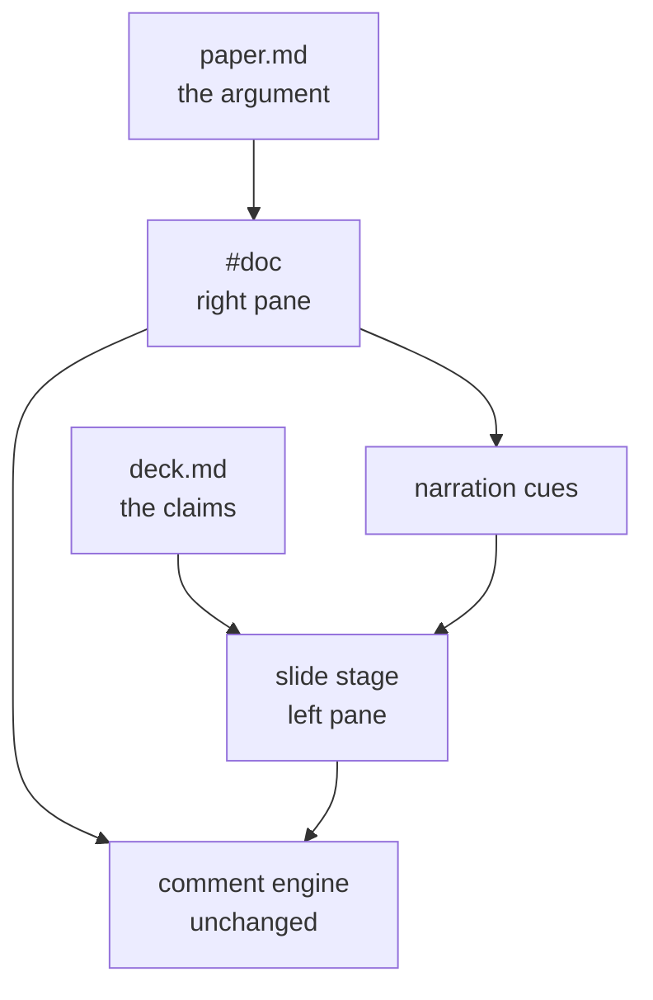
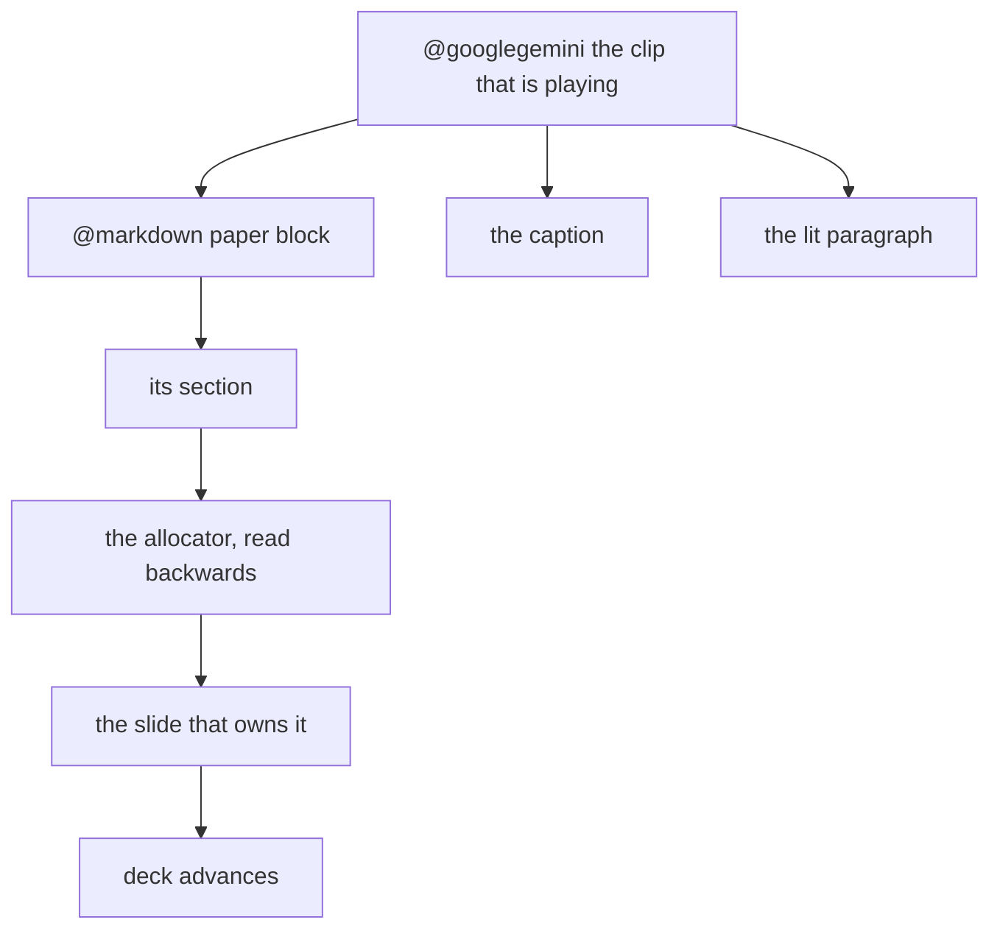

pd-slides
# A deck compresses, a paper argues

The deck carries the claim. The paper carries the reason. Most reviews lose one of them.

:::deep
Put them on one screen and pair them, and "why do you believe that" stops being a different tab.
:::

:::note
Press `p` for the paper, `a` to have it read itself aloud, `t` for captions.
:::

---

Architecture
# The split screen

The right pane is not an appendix. It is the whole document, rendered as an ordinary page.



:::cols
### What that bought
The comment engine needed **zero** changes to work in the paper pane.
### What it cost
One line, correcting the rail's coordinate origin when the pane scrolls itself.
:::

---

Decision 1
# Every slide owns a section

Pairing a deck to a paper is an allocation, not a lookup. Deciding one slide's section alone is what let two collide.

:::cards
### Pass 1 | strong
`:::paper` anchor pins outright
beats everything below it
### Pass 2 | solid
title match, forward-only
exact, then prefix, then word containment
### Pass 3 | good
gap fill in document order
wraps if a pin jumped ahead
:::

:::deep
Total and collision-free: no two slides share a section while one is free, and no slide opens the pane onto nothing.
:::

---

Decision 2
# The section wears a focus layer

Landing on the right section is half of it. Knowing you landed there is the other half.

:::stats
32% | dimmed | non-paired sections
3px | rule | on the block being read
1 | key | `o` drops the layer
:::

:::note
The tag on the lit card reads `Slide 4 / 8 · The section wears a focus layer` - it names which slide the evidence belongs to.
:::

---

Decision 3
# The narration is the paper

A talk track is normally a third artifact. It drifts from the document within a week.

Here it is not written at all. It is the paper's own paragraphs, read word for word.

:::deep
Because the words are identical, there is nothing to align. No timestamps, no subtitle file, no forced alignment, no speech recognition.
:::

| What you normally build | What this needs |
|---|---|
| an SRT or VTT track | none |
| forced alignment pass | none |
| a separate narration doc | none |
| word-level timestamps | none |

---

Decision 4
# The slides follow for free

Each block knows its section. The allocator maps sections to slides. Read it backwards.



:::deep
Everything hangs off one node - the clip that is playing. That is the entire synchronisation model.
:::

---

Edge case
# What cannot be read aloud

A table read literally is pipes and dashes. A diagram read literally is silence.

:::cols
### Skipped
tables, code fences, diagrams, images
### Bridged
an HTML comment beside them, invisible in the paper, spoken in their place
:::

```markdown
| Block | Lines | Hand-styled |
|---|---|---|
| cards | 5 | 25 |

<!-- say: A card row is five lines instead of twenty-five. -->
```

---

Honesty
# What it costs

:::cards
### Word cursor | worth exploring
estimated from character count
no word timings from the speech API
### Highlight granularity | worth exploring
paragraph in the paper, word in the captions
the paper is a commentable surface
### Clip length | solid
paragraph is the floor
sentence clips start cold and sound it
:::

:::note
A first run on a three-thousand-word paper is roughly sixty speech calls. Every clip is cached by the hash of its own text.
:::


---

Plus
# The diagram is editable

Every mermaid diagram in this deck is already an Excalidraw canvas. Drag a box on slide 2 or 6 - it saves to `diagrams/`, a real file that opens in excalidraw.com.

The paper keeps the rendered mermaid, because the paper is the uneditable source of truth. The canvas is a derived view of it, which is what makes **Reseed** safe.

:::cols
### Mermaid
the authoring format - cheap to write, lives in the markdown, canonical in the paper
### Excalidraw
the editor - drag it into shape on the slide, autosaves 700ms after you stop
:::

:::note
Disk wins on load, so your layout survives a rebuild *and* an edit to the mermaid. Reseed throws the canvas away and rebuilds from the paper.
:::

---

Plus
# The app is the slide

`app <url>` frames a running dev server, so the deck shows the real thing rather than a screenshot of it.

```app http://localhost:7788 380
```

:::deep
This one is framing the deck's own server, which is the cheapest possible proof that it works.
:::

---

Plus
# A live site, running, inside a slide

Not a screenshot of the site. The site.

```app https://example.org 460
```

:::note
Framing works only when the target sends no `X-Frame-Options` and no `frame-ancestors` policy. Most SaaS does; a site that refuses shows a blank frame and nothing you can do about it from here.
:::

