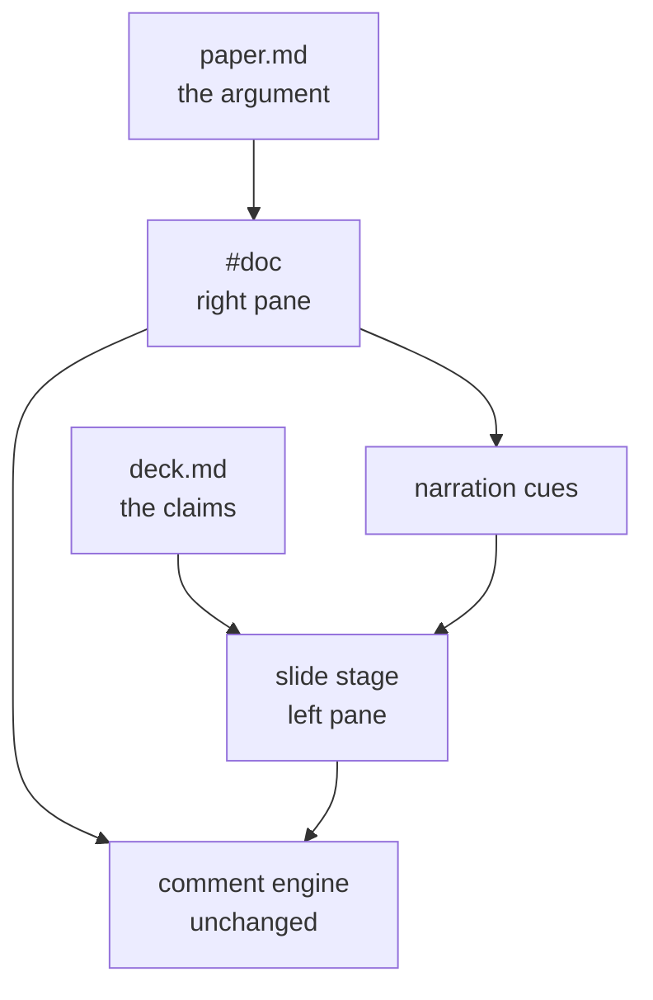
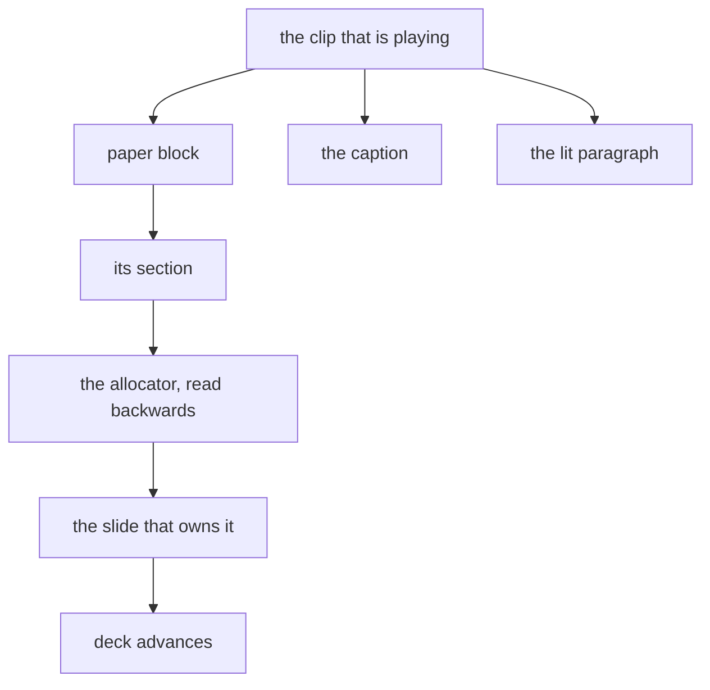

# A deck compresses, a paper argues

Every review deck loses the same thing.
The deck carries the claim and the paper carries the reason, and by the time anyone asks "why do you believe that", the paper is a different file in a different tab.

The fix is not a better deck. It is refusing to separate them.
pd-slides puts the deck on the left and the whole source document on the right, and pairs them so that the evidence for whatever slide you are on is always the thing you are looking at.

<!-- say: What follows is the argument for each of the four decisions that shape the tool. Read it, or press A and let it read itself. -->

## The split screen

The left pane is a slide stage. The right pane is not a summary or an appendix - it is `paper.md`, rendered exactly as an ordinary document, and it reads standalone.

Both panes take margin comments, and neither one reflows when you add them.



The decision that made this cheap: the right pane *is* the ordinary browser-preview document.
The comment engine - selection spans, line tagging, rail layout, the copy serialisers - needed no changes at all to work inside it.

<!-- say: The diagram is worth one sentence. Both panes feed the same comment engine, and the paper additionally feeds the narration, which drives the slides back. One machine, not three. -->

## Every slide owns a section

The first version paired each slide to a paper heading on its own, by title, and took no scroll when nothing matched.

That was the wrong shape. Pairing a deck to a paper is an **allocation**, and deciding slide four's section in isolation is exactly what let two slides land on the same heading while a third landed nowhere.

So it is allocated, once, in three passes.

| Pass | Rule | Beats |
|---|---|---|
| 1 | an explicit `:::paper` anchor pins outright | everything |
| 2 | title match, forward-only, unclaimed only | pass 3 |
| 3 | gap fill in document order, wrapping if a pin jumped ahead | nothing |

The result is total and collision-free. No two slides share a section while one is free, and no slide opens the pane onto nothing.

<!-- say: The table is three rules in priority order. An explicit anchor beats a title match, and a title match beats filling the gaps - and the third pass is what guarantees every slide lands somewhere. -->

Only a paper with genuinely fewer sections than the deck has slides forces sharing, and the build warns about that where the author can still fix it.

## The section wears a focus layer

Landing on the right section is half of it. Knowing you landed there is the other half.

The paired section lifts into a tinted card carrying the slide's number and title, and every other section dims back behind it.

| Element | Value | What it marks |
|---|---|---|
| dimmed | 32% | every section this slide does not own |
| left rule | 3px | the block currently being read aloud |
| `o` | 1 key | drops the whole layer |

<!-- say: Three signals, in order of how loud they are. Unpaired sections fade to a third of their weight, the paragraph being read carries a rule down its left edge, and the O key turns all of it off. -->

Press `o` and the paper is a plain document again, with the pairing and the scroll still intact.

## The narration is the paper

A talk track is normally a third thing somebody writes, and it drifts from the document within a week.

Here it is not written at all. The narration **is** the paper's own paragraphs, read word for word, one clip per block.

<!-- say: This next point is the one that makes the whole feature cheap, so it is worth slowing down for. -->

Because the words are identical, there is nothing to align.
No timestamps, no subtitle file, no forced alignment pass, no speech recognition.
The clip boundary is the block boundary, so which clip is playing **is** the highlighted paragraph, **is** the caption on screen, **is** which slide is showing.

Nothing can drift, because there is no independent clock for it to drift against.

## The slides follow for free

Each paper block already knows its section. The allocator already maps every section to a slide.

Read those two facts backwards and the deck advances itself: crossing into a new section moves the slide.



One play button drives the audio, the captions, the highlight and the deck.

<!-- say: Everything on that diagram hangs off one node - the clip that is playing. That is the whole synchronisation model. -->

## What cannot be read aloud

A table read literally is pipes and dashes. A diagram read literally is nothing at all.

So tables, code, diagrams and images are skipped, and each one gets a bridge line written beside it in an HTML comment - invisible in the rendered paper, spoken in its place, lighting the block it stands for.

```markdown
| Block | Lines | Hand-styled |
|---|---|---|
| cards | 5 | 25 |

<!-- say: A card row is five lines instead of twenty-five. -->
```

A bridge is not a caption. It says what the reader should take from the thing, in one sentence. It is the only prose anyone writes twice, and only where prose genuinely cannot carry the point.

## What it costs

Honesty about the seams, in the order they will bite.

The caption's word cursor is **estimated** - the clip's duration spread across the paragraph by character count - because the speech API returns no word timings. It drifts a little inside a long paragraph and re-syncs hard at every block.

The word cursor lives in the captions and not in the paper, because the paper is a commentable surface whose engine walks its text nodes.

Paragraph is the floor on clip length. Sentence-level clips start cold and sound it.

> A first run on a three-thousand-word paper is roughly sixty speech calls.
> Every clip is cached by the hash of its own text, so editing one paragraph re-speaks one paragraph.

None of these are hard limits. They are the places where a cheaper answer was taken deliberately, and each one has an upgrade path that costs a dependency.


## The diagram is editable

A diagram in a review deck is normally an export - a picture of a decision, already stale by the time anyone argues with it.

Here it is the decision. A ```draw fence mounts a real Excalidraw canvas in either pane, and every edit autosaves to a `.excalidraw` file in the repo, which opens in excalidraw.com like any other.

<!-- say: The point is that the file is the source of truth, not the deck. The deck is one editor for it. -->

## The app is the slide

The same argument, one step further. An `app` fence frames a URL, so a slide can hold the running product instead of a screenshot of it.

This only became possible on a server. A `file://` page cannot frame `http://localhost` at all, which is the single fact that separates this skill from its parent.
